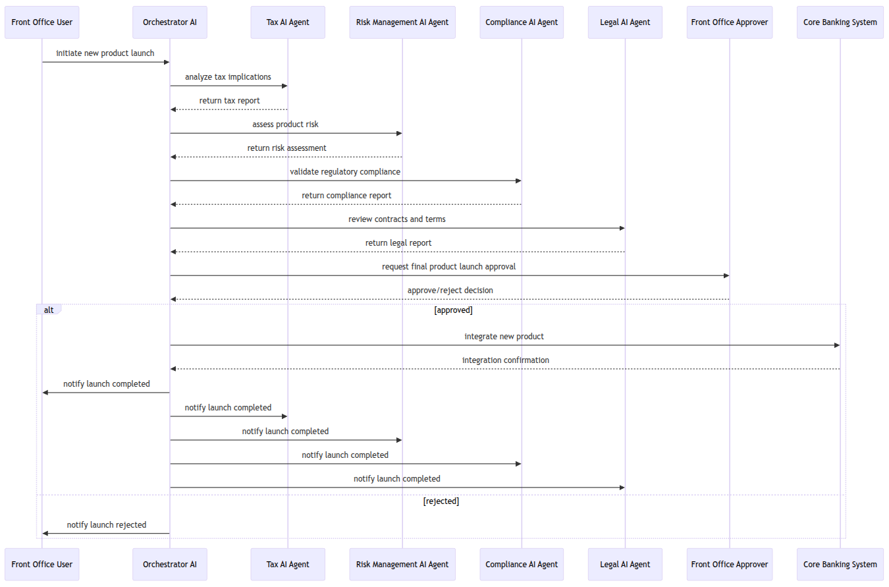

# The Revolution in Agentic AI: AgentraOS

AgentraOS is the next-generation Agentic AI framework built to transform how organizations operate in the age of intelligent automation.  

With AgentraOS, you can unify all your company’s digital systems into one intelligent ecosystem of autonomous AI agents — seamlessly collaborating, adapting, and executing decisions in real time.  

Built for trust, governance, and explainability, AgentraOS delivers enterprise-grade transparency and control across even the most highly regulated environments.

---

## 🧠 Unboxing the Black Box

A black box within a black box — not with AgentraOS.  

Transparency is core to AgentraOS, ensuring every model decision, parameter, and interaction can be understood, traced, and explained. No more guesswork. No more hidden logic.

AgentraOS lets you:
- Perform live what-if analyses across distributed agent networks  
- Adjust prompts and parameters instantly based on contextual insights  
- Observe real-time agent collaboration and adaptation  
- Unlock reproducible and testable AI behavior across your organization  

Say goodbye to opaque systems. Say hello to visible intelligence.

---

## 🔒 Building Trust and Compliance

AgentraOS embeds compliance, explainability, and traceability at every level — empowering organizations to go beyond AI adoption and into AI assurance.  

- Every agent interaction is logged and auditable  
- All inference parameters are securely recorded for reproducibility  
- Designed to meet the highest standards in regulated industries  
- Built-in support for governance, auditing, and lifecycle traceability  

With AgentraOS, trust is not an add-on — it’s foundational.

---

## 🌐 Connected Intelligence for the Enterprise

Disconnected systems cause data silos, inefficiencies, and integration headaches. AgentraOS solves this by enabling seamless interoperation through standardized, agent-driven communication protocols.

By deploying AgentraOS, organizations can:
- Broaden and unify access to enterprise knowledge  
- Enable secure, real-time knowledge sharing across systems  
- Automate workflows dynamically — even without predefined logic  
- Coordinate autonomous collaboration between agents and humans  
- Drive continuous, adaptive optimization powered by implicit automation  

The result? Reduced costs, accelerated innovation, and a smarter organization that never stops improving.

---

## 🚀 Why AgentraOS

AgentraOS is not just software—it’s a shift in how AI is designed, deployed, and governed.  
It empowers teams to move from managing systems to orchestrating intelligence.

Transform. Simplify. Automate. Govern.  
All within one unified Agentic AI framework.

---

# Sample Workflow: New Product Process
In the following workflow you see how AgentraOS will process the request for new financial product:

---

## 🌍 Learn More

[Visit AgentraOS →](https://agentraos.com/en#unboxing_the_blackbox)
